# Publishing a Project with Docker

When your project is ready for publication, you need to select a way of publication. SnapDevelop currently supports three ways of publication, which are Web Deploy, File System, and Docker respectively. Publication using Web Deploy and File System has been introduced in [Publish and Host Apps Developed in SnapDevelop](https://docs.appeon.com/appeon_online_help/snapdevelop2019/publish/index.html). Therefore, this article introduces how a project can be published with Docker.

## Prerequisites

If you want to publish a project with Docker, you need to meet the following requirements:

-   Windows 10 (64-bit)

-   Internet access

-   **Docker for Windows** (downloaded from <https://hub.docker.com/?overlay=onboarding>, login is required)

-   A project ready for publication

-   Basic Docker knowledge

-   Hyper-V installed and enabled

    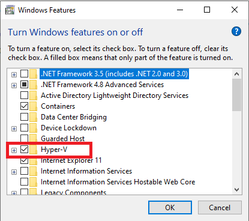{width="3.522245188101487in" height="3.125in"}

## Understanding Docker Basics

Before you begin to publish with Docker, you need first of all to be familiar with what Docker is.

Docker is an open platform that can be used to develop, ship, and run apps. It can ship, test, and deploy code very quickly so that you can considerably reduce the delay between writing code and running it in the production environment. There are three essential concepts intimately associated with Docker publication:

-   **Image**; An image is a read-only template that contains instructions for creating a Docker container.

-   **Container**; A container is an executable instance of an image. The major difference between an image and a container is that a container contains top readable and writable layers.

-   **Repository**; A repository is a place where images are stored.

For more information about Docker and its essential concepts, please visit Docker's official website (<https://docs.docker.com/engine/docker-overview/>).

### Docker Registration

You can take the following steps to sign up for Docker Hub.

1.  Run **Docker Desktop**.

2.  Click the Docker icon at the bottom right corner of the desktop and then select **Docker Hub**.

    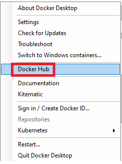{width="2.5729166666666665in" height="3.4635411198600177in"}

3.  On the Docker Hub home page that appears, select **Sign Up for Docker Hub**.

    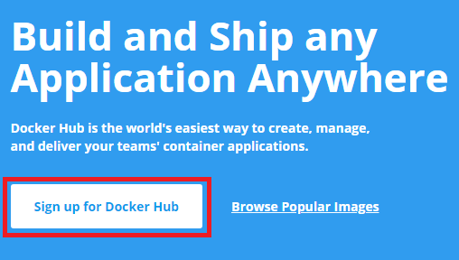{width="3.949501312335958in" height="2.2291666666666665in"}

4.  Enter the required information.

    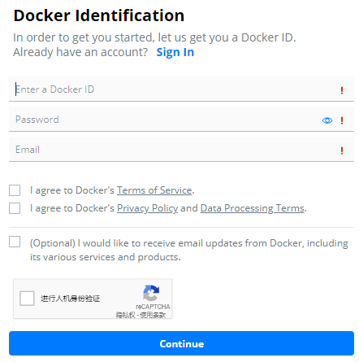{width="3.9166666666666665in" height="3.9432502187226595in"}

### Configuring Docker

You need to configure Docker so that it can be properly used for publication. To configure Docker, you need to pull a registry and build the registry, and then configure Daemon.

#### Pulling Registry

You can either pull a registry from Docker Hub or to load a registry locally if the registry already exists on your computer.

Run the following command to pull a registry from Docker Hub (make sure your computer have access to Docker Hub):

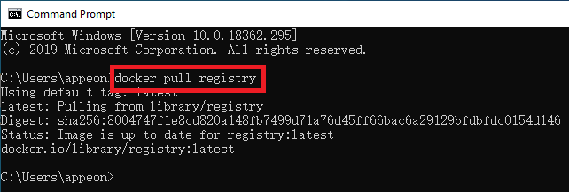{width="5.489583333333333in" height="1.8477132545931758in"}

Run the following command to load a registry from a local computer:

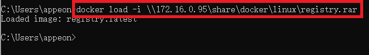{width="5.489583333333333in" height="0.8152843394575678in"}

#### Building Registry

When a registry is successfully pulled or loaded, you need to build the registry by using a command line similar to the following one.

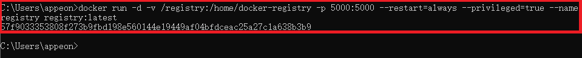{width="6.498991688538933in" height="0.65625in"}

#### Configuring Daemon

When you have built the registry, you need to configure Daemon. To configure Daemon, you:

1.  Run **Docker Desktop**.

2.  Click the Docker icon at the bottom right corner of the desktop and then select **Settings**.

3.  Select **Daemon** on the **Settings** page.

4.  Configure **Insecure Registries** (if you want to publish your project to Docker Hub, you just enter **registry.hub.docker.com** here; if you want to publish your project to Docker installed on your local machine, you need to specify the IP address of the local machine).

5.  Select **Apply** to validate Daemon configuration.

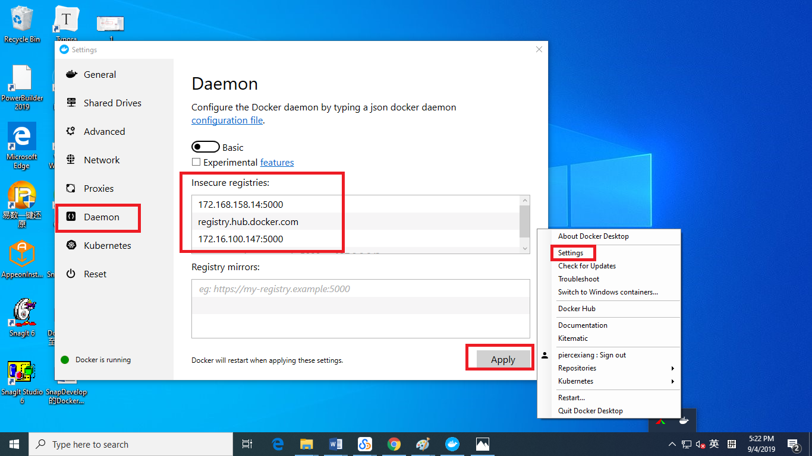{width="6.5in" height="3.659038713910761in"}

### Common Docker Commands

The "Configuring Docker" section has shown you a few examples on how to run Docker. The following table lists some common Docker commands and the meanings of individual commands.

| **Command**                 | **Description**                                              |
| --------------------------- | ------------------------------------------------------------ |
| docker images               | Views information about images included in Docker.           |
| docker ps                   | Views information about the running container.               |
| docker build                | Builds an image from a Dockerfile.                           |
| docker run                  | Runs a command in a new container.                           |
| docker rmi                  | Removes an image via image name or image ID.                 |
| docker rm                   | Removes a container via container name or container ID.      |
| docker pull                 | Pulls an image or a repository from a registry.              |
| docker push                 | Pushes an image or a repository to a registry.               |
| docker network              | Manages network configuration.                               |
| docker save                 | Packs an image.                                              |
| docker load                 | Loads an image.                                              |
| docker-compose build        | Turns services into images.                                  |
| docker-compose up           | Launches the already available images so that they run as containers. |
| docker-compose down         | Stops and deletes everything created using the *docker-compose up* command. |
| docker inspect network name | Inspects network details.                                    |
| docker attach               | Attaches local standard input, output, and error streams to a running container |

Note: You can view all necessary information about docker image or container if you add '-a' to command 'docker images' or 'docker ps', and you can forcefully delete what you want to delete by adding '-f' to command 'docker rmi' or 'docker rm'. For more information about docker commands, please visit Docker's official website (<https://docs.docker.com/engine/reference/commandline/docker/>).

## Publishing to Docker

When you have a project ready for deployment, you can choose to publish the project to Docker. You can publish to Docker in three different ways - you can publish your project to Docker Hub if your computer has access to Docker Hub; you can publish your project to a local Docker if you have installed Docker on your local machine; to you can publish your project to a remote Docker.

### Publishing to Docker Hub

Docker Hub is a service offered by Docker for identifying and sharing container images with a particular team. You can take the following steps to deploy your project to Docker Hub:

1.  Register Docker Hub (see the Docker Registration section).

2.  Create a repository in Docker Hub.

3.  Configure Docker following the instructions in the Configuring Docker section. Make sure you have specified Docker Hub registry during Daemon configuration.

4.  Right-click the node of the project to be published in **Solution Explorer**, select **Add** and then select **Docker Support**.

    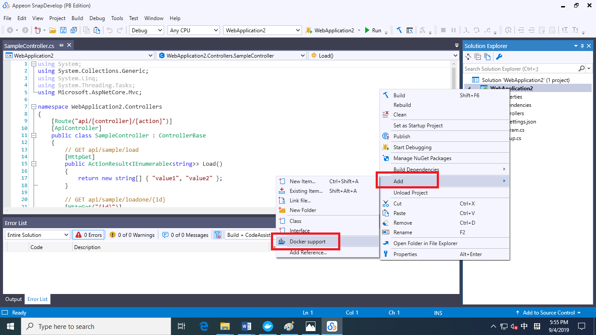{width="6.24375in" height="3.59375in"}

5.  On the **Dockerfile options** page that pops up, select the target operating system (Windows or Linux), depending on whether you have changed the container, which defaults to Linux.

    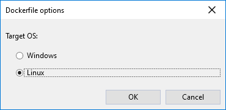{width="3.8229166666666665in" height="1.8597965879265093in"}

6.  Check the Dockerfile.

    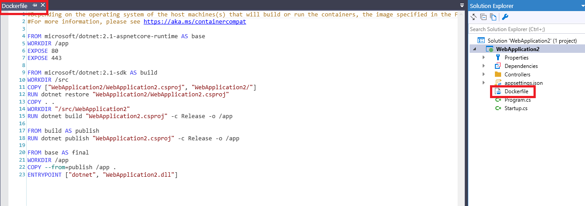{width="6.206944444444445in" height="2.4479166666666665in"}

    The following table presents a brief introduction to the Dockerfile:
    
    | **Command** | **Description**                                              |
    | ----------- | ------------------------------------------------------------ |
    | FROM        | Specifies the container image that will be used during the creation of a new image. |
    | :           | Marks the version of an image.                               |
    | AS          | Specifies an alias.                                          |
    | RUN         | Specifies the commands that will be run and captured in the new container image. These commands include commands to install software, create files and directories, and create environment configurations. |
    | COPY        | Copies files and directories to the container\'s file system. Files and directories must be in the path relative to the Dockerfile. |
    | WORKDIR     | Sets a working directory for other Dockerfile directives (such as RUN, CMD) and sets up a working directory for running container image instances. |
    | ENTRYPOINT  | Specifies which command to execute after a container is started, allowing you to configure the container that will run as an executable. |
    | EXPOSE      | Specifies the local port that the Docker server container maps externally. The EXPOSE directive tells the Docker container to listen on the specified network port at runtime. You can specify whether the port listens for TCP or UDP, and if no protocol is specified, it defaults to TCP. |

7.  Right-click the project in **Solution Explorer** and then select **Publish**.

    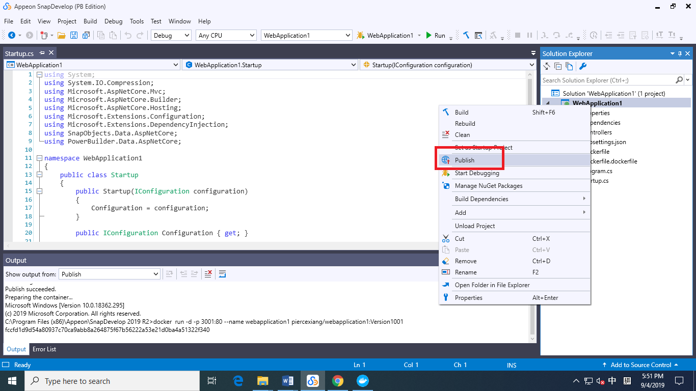{width="6.0596084864391955in" height="3.40625in"}

8.  In the **Publish** pop-up window that follows, select **Docker** and then configure the "Connection" and "Settings" options.

    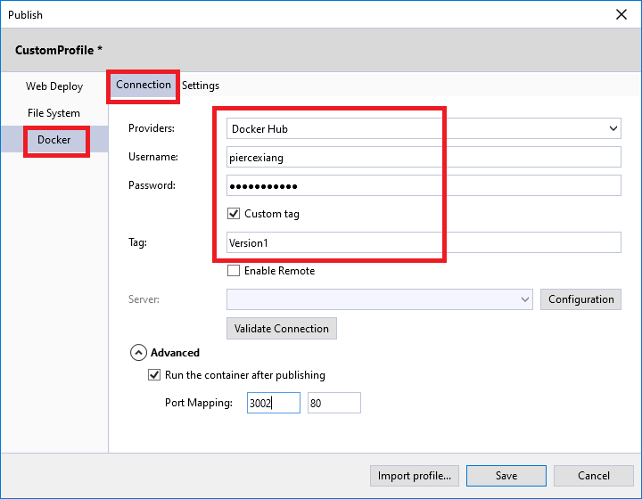{width="5.447507655293088in" height="4.239583333333333in"}

    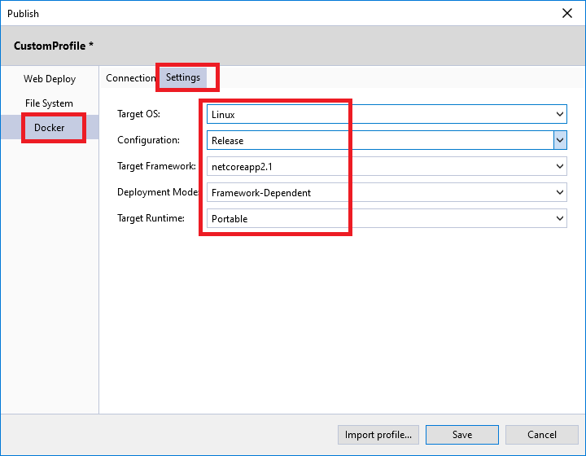{width="5.447916666666667in" height="4.239900481189851in"}

9.  Select **Save** after Docker configuration.

10. On the **Publish** page, select **Publish** to deploy your project.

    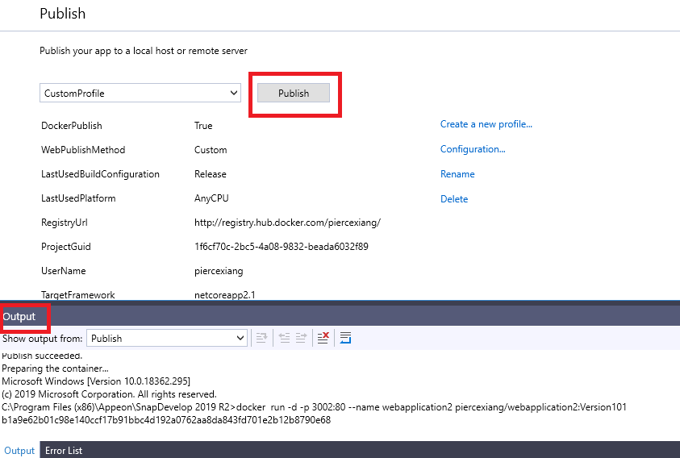{width="6.119505686789151in" height="4.125in"}

11. Check if your project is successfully published to the repository in Docker Hub.

    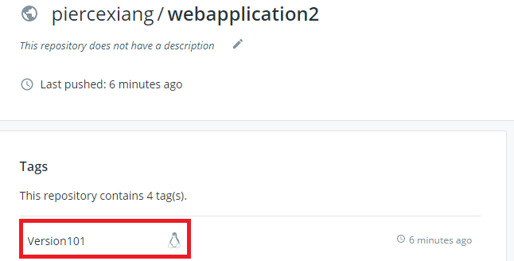{width="5.4625in" height="2.7708333333333335in"}

### Publishing to Local Docker

You can publish your project to your local Docker if

### Publishing to Remote Docker

You can publish your project to a remote Docker if you
