# Using SQL Query

Database has nowadays become a very popular method for data storage. A database usually stores tons of data. How can one retrieve a particular piece of data from the vast database? This is where SQL Query comes in.

SnapDevelop's SQL Query currently supports connection to four types of database, which are **SQL Server**, **Oracle**, **PostgreSQL**, and **ODBC (ASA Only)**. It allows you to view data from the database, write and execute your SQL statements, select particular ways in which your query results display, see how your SQL statements are executed, and export the query results to an external file.

This tutorial walks you through exactly how you can use SnapDevelop's SQL Query.

## Creating Database Connection

You need to establish a database connection first in order to perform the various SQL Query operations. To connect to a database, you need to:

-   Access the Database Connection dialog box;

-   Specify the data source;

-   Configure the database connection properties;

-   Test the connection;

-   Save the connection string.

### Accessing the Database Connection Dialog Box

To access the **Database Connection** dialog box, you:

1.  Select **View** on the top menu bar and then select **DB Server Explorer** so that the **DB Server Explorer** appears.

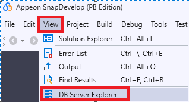{width="3.0208333333333335in" height="1.6288812335958005in"}

2.  In **DB Server Explorer**, select the **Connect to the database** icon to open the **Database Connection** dialog box.

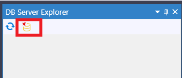{width="2.375in" height="1.02786854768154in"}

3.  Select **New** to configure the various database connection properties.

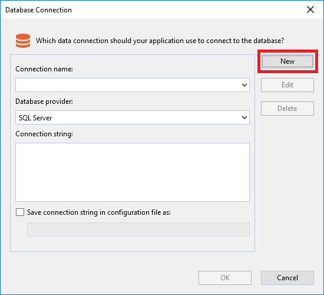{width="4.75in" height="4.3181813210848645in"}

### Specifying the Data Source

SnapDevelop currently supports connection to databases from four data sources, which are **SQL Server**, **Oracle**, **PostgreSQL**, and **ODBC (ASA Only)**. The data source is set to **SQL Server** by default. If the data source is not what you want, you can select a new data source from the **Database provider** list box.

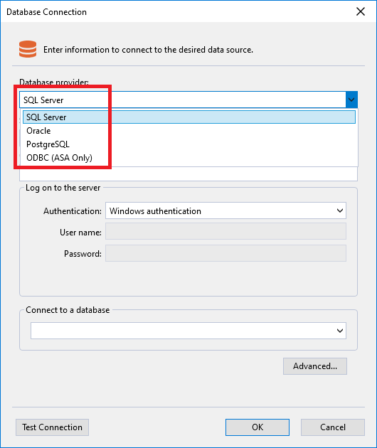{width="4.802083333333333in" height="5.706003937007874in"}

### Configuring Database Connection Properties

After you have specified the data source, you can then proceed to configure the basic and advanced connection properties for the corresponding data source.

#### SQL Server

If you have selected **SQL Server** as the data source, you need to configure the variety of basic and advanced connection properties for SQL Server.

**Basic Properties**

The following table lists the basic connection properties you need to configure for SQL Server.

|  **Property**          |   **Description**		|
|----------------------- | ---------------------------------------------------------------------------------------------------------------------------------------------------------------------------------------------------------------------------------------------------------- |
|  Server name           |  Indicates the IP address of the server where the database you want to connect to is located.		|
|  Connection name       |  Indicates the name for your connection. |
|  Authentication        |  Indicates the method of authentication. There are four methods of authentication, which are **Windows authentication**, **SQL Server authentication**, **Active Directory Password authentication**, and **Active Directory Integrated authentication**. |
|  User name             |  Indicates the server login name. |
|  Password              |  Indicates the server login password. |
|  Connect to a database |  Specifies the database you want to connect to. |

The following screenshot demonstrates how you can cofigure the basic connection properties for SQL Server.

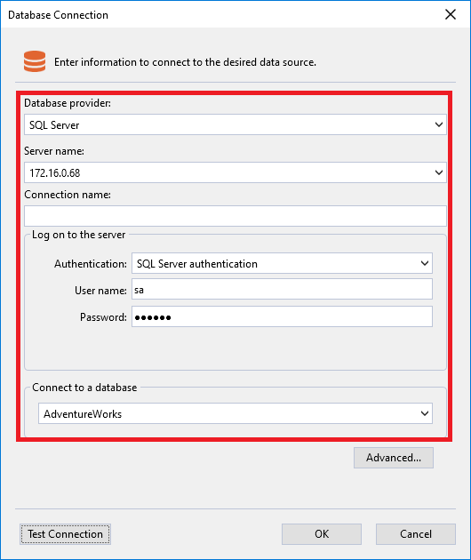{width="4.458333333333333in" height="5.297549212598425in"}

**Advanced Properties**

After you have selected SQL Server as the data source and configured the basic database connection properties accordingly, you can proceed to configure the advanced database connection properties. The following table lists the advanced properties you can configure for SQL Server.

|  **Property**       |   **Sub-Property**          |   **Description** |
|-------------------- | --------------------------- | -------------------------------------------------------------------------------------------------------------------------------------------------------------- |
|  **Initialization** |   Application Intent        |   Declares application workload type when connecting to server. |
|  **Misc**           |   Authentication Type       |   Specifies the authentication type. |
|                     |   Server Host               |   Specifies the server host. |
|                     |   Server Port               |   Specifies the server port. |
|  **Pool**           |   Enlist                    |   Sessions in the Environment of Component Service (MTS if Microsoft Windows NT is used) should be automatically enlisted in global transactions if necessary. |
|                     |   Load Balance Timeout      |   The minimum amount of time (in seconds) that this connection survives in the pool until it is destroyed. |
|                     |   Max Pool Size             |   The maximum number of connections allowed in the pool. |
|                     |   Min Pool Size             |   The minimum number of connections allowed in the pool. |
|                     |   Pool Blocking Period      |   Defines pause time behavior for connection pooling. |
|                     |   Pooling                   |   When true, the connection object is drawn from the appropriate pool, or if necessary, is created and added to the appropriate pool. |
|  **Safety**         |   Authentication            |   Specifies how SQL Server authenticates. |
|                     |   Column Encryption Setting |   Default column encryption settings for all commands on the connection. |
|                     |   Encrypt                   |   If true, and the server has a certificate installed, SQL Server will use SSL encryption for all data sent between the client and the server. |
|                     |   Integrated Security       |   Whether the connection is secure. |
|                     |   Password                  |   Indicates the password to use when connecting to the data source. |
|                     |   User ID                   |   Indicates the user ID to use when connecting to the data source. |
|  **Source**         |   Attach DB Filename        |   The name of the primary file, including the full path name, of an attachable database. |
|                     |   Data Source               |   Indicates the data source address or name to connect to. |
|                     |   Initial Catalog           |   The name of the initial directory or database in the data source. |

#### Oracle

If you have selected **Oracle** as the data source, you need to configure the variety of basic and advanced connection properties for Oracle.

**Basic Properties**

The following table lists the basic connection properties you need to configure for Oracle.

|  **Property**    |   **Description** |
|----------------- | ------------------------------------------------------------------------------------------------------------------------------ |
|  Host            |   Indicates the server machine on which an Oracle database resides. |
|  Port            |   Indicates the port on a host bus adapter that offers the physical connection to a controller and is used for I/O operations. |
|  Service name    |   Specifies that a database can register itself with the listener. |
|  Connection name |   Indicates the name for your connection. |
|  User name       |   Indicates the server login name. |
|  Password        |   Indicates the server login password. |

**Advanced Properties**

After you have selected Oracle as the data source and configured the basic database connection properties accordingly, you can proceed to configure the advanced database connection properties. The following table lists the advanced properties you can configure for Oracle.

|  **Property**     |  **Sub-Property**        |  **Description**  |
|----------------- | ------------------------ | ----------------------------------------------------------------------------------------------------------------------------------------------------------------------------------------------------------------------------------- |
|  **Data Source** |   Host                   |   Indicates the server machine on which an Oracle database resides. |
|                  |   Port                   |   Indicates the port on a host bus adapter that offers the physical connection to a controller and is used for I/O operations. |
|                  |   Protocol               |   Specifies a set of rules and regulations that determine how data is transmitted. Four options are available, which are TCP, TcpWithSsl, IPC, and NMP. |
|                  |   Server                 |   Indicates the IP address of the server where the database you want to connect to is located. |
|                  |   Service Name           |   Specifies that a database can register itself with the listener. |
|  **Misc**        |   Connection Lifetime    |    |
|                  |   Connection Timeout     |    |
|                  |   DBA Privilege          |    |
|                  |   Enlist                 |   Whether to enlist in an ambient TransactionScope. |
|                  |   HA Events              |    |
|                  |   Incr Pool Size         |    |
|                  |   Load Balancing         |    |
|                  |   Max Pool Size          |   The maximum number of connections allowed in the pool. |
|                  |   Metadata Pooling       |    |
|                  |   Min Pool Size          |   The minimum number of connections allowed in the pool. |
|                  |   Persist Security Info  |    |
|                  |   Pooling                |   The time to wait before closing unused connections in the pool if the count of all connections exceeds MinPoolSize. |
|                  |   Promotable Transaction |    |
|                  |   Self Tuning            |    |
|                  |   Server Host            |    |
|                  |   Server Port            |    |
|                  |   Statement Cache Purge  |    |
|                  |   Statement Cache Size   |    |
|                  |   Validate Connection    |    |
|  **Other**       |   Users                  |   When you need to access objects from other users, you can add users here. Note that this data will not be saved, so you must edit this content each time you use the database connection. The format is as follows: user1, user2. |
|  **Proxy**       |   Proxy Password         |   Indicates the password you need to enter in order to gain access to the proxy server. |
|                  |   Proxy User ID          |   Indicates the user account to which you want to log in as a proxy. |
|  **Safety**      |   Password               |   Indicates the password to use when connecting to the data source. |
|                  |   User ID                |   Indicates the user ID to use when connecting to the data source. |
|  **Source**      |   Data Source            |   Indicates the data source address or name to connect to. |
|                  |   Initial Catalog        |   The name of the initial directory or database in the data source. |

#### PostgreSQL

If you have selected **PostgreSQL** as the data source, you need to configure the variety of basic and advanced connection properties for PostgreSQL.

**Basic Properties**

The following table lists the basic connection properties you need to configure for PostgreSQL.

|  **Property**    |   **Description** |
|----------------- | ------------------------------------------------------------------------------------------------------------------------------ |
|  Host            |   Indicates the server machine on which a PostgreSQL database resides. |
|  Port            |   Indicates the port on a host bus adapter that offers the physical connection to a controller and is used for I/O operations. |
|  Connection name |   Indicates the name for your connection. |
|  Database name   |   Indicates the name for the database you want to connect to. |
|  User name       |   Indicates the server login name. |
|  Password        |   Indicates the server login password. |

**Advanced Properties**

After you have selected PostgreSQL as the data source and configured the basic database connection properties accordingly, you can proceed to configure the advanced database connection properties. The following table lists the advanced properties you can configure for PostgreSQL.

|  **Property**              |  **Sub-Property**             |  **Description** |
|--------------------------- |------------------------------ |----------------------------------------------------------------------------------------------------------------------------------------------------------------------------------------------------------------------- |
|  **Advanced**              |  Auto Prepare Min Usages      |  The minimum number of usages a SQL statement is used before it is automatically prepared. This number defaults to 5. |
|                            |  Keepalive                    |  The number of seconds of connection inactivity before Npgsql sends a keepalive query. |
|                            |  Load Table Composites        |  Load table composite type definitions, and not just free-standing composite types. |
|                            |  Max Auto Prepare             |  The maximum number of SQL statements that can be automatically prepared at any given point. Beyond this number the least-recently-used statement will be recycled. Zero (the default) disables automatic preparation. |
|                            |  No Reset On Close            |  If set to true, a pool connection's state won't be reset when it is closed (improves performance). Do not specify this unless you know what you are doing. |
|                            |  Read Buffer Size             |  Determines the size of the internal buffer Npgsql uses when reading. Increasing may improve performance if transferring large values from the database. |
|                            |  Socket Receive Buffer Size   |  Determines the size of socket receive buffer. |
|                            |  Socket Send Buffer Size      |  Determines the size of socket send buffer. |
|                            |  TCP Keepalive                |  Whether to use TCP keepalive with system defaults if overrides isn't specified. |
|                            |  TCP Keepalive Interval       |  The interval, in milliseconds, between when successive keep-alive packets are sent if no acknowledgement is received. |
|                            |  TCP Keepalive Time           |  The number of milliseconds of connection inactivity before a TCP keepalive query is sent. |
|                            |  Use Perf Counters            |  Writes connection performance information to performance counters. |
|                            |  Write Buffer Size            |  Determines the size of the internal buffer Npgsql uses when writing. Increasing may improve performance if transferring large values to the database. |
|  **Compatibility**         |  Convert Infinity Date Time   |  Makes MaxValue and MinValue timestamps and dates readable as infinity and negative infinity. |
|  **Connection**            |  Application Name             |  The optional application name parameter to be sent to the backend during connection initiation. |
|                            |  Client Encoding              |  Gets or sets the client encoding parameter. |
|                            |  Encoding                     |  Gets or sets the .NET encoding that will be used to encode/decode PostgreSQL string data. |
|                            |  Enlist                       |  Whether to enlist in an ambient TransactionScope. |
|                            |  Host                         |  The host name or IP address of the PostgreSQL server to connect to. |
|                            |  Passfile                     |  Path to a PostgreSQL password file (PGPASSFILE), from which the password would be taken. |
|                            |  Port                         |  The TCP port of the PostgreSQL server. |
|                            |  Search Path                  |  Gets or sets the schema search path. |
|                            |  Time Zone                    |  Gets or sets the PostgreSQL session time zone, in Olson/IANA database format. |
|                            |  User Name                    |  The user name to connect with. Not required if using IntegratedSecurity. |
|  **Entity Configurations** |  Entity Admin Database        |   |
|                            |  Entity Template Database     |  The database template to specify when creating a database in Entity Configurations. If not specified, PostgreSQL defaults to \\"template1\\". |
|  **Misc**                  |  Server Host                  |  Specifies the server host. |
|                            |  Server Port                  |  Specifies the server port. |
|  **Pooling**               |  Connection Idle Lifetime     |  The time to wait before closing unused connections in the pool if the count of all connections exceeds MinPoolSize. |
|                            |  Connection Pruning Interval  |  How many seconds the pool waits before attempting to prune idle connections that are beyond idle lifetime. |
|                            |  Max Pool Size                |  The maximum connection pool size. |
|                            |  Min Pool Size                |  The minimum connection pool size. |
|                            |  Pooling                      |  Specifies whether connection pooling should be used. |
|  **Safety**                |  Password                     |  Indicates the password to use when connecting to the data source. |
|                            |  User ID                      |  Indicates the user ID to use when connecting to the data source. |
|  **Security**              |  Check Certificate Revocation |  Specifies whether to check the certificate revocation list during authentication. |
|                            |  Include Realm                |  Specifies whether to use the Kerberos for authentication. |
|                            |  Integrated Security          |  Specifies whether to use Windows integrated security to log in. |
|                            |  Persist Security Info        |  Gets or sets a Boolean value that indicates if security-sensitive information, such as the password, is not returned as part of the connection if the connection is open and has ever been in an open state. |
|                            |  SSL Mode                     |  Specifies whether SSL is required, disabled, or preferred, depending on server support. |
|                            |  Trust Server Certificate     |  Specifies whether to trust the server certificate without validating it. |
|                            |  Use SSL Stream               |  Npgsql uses its own internal implementation of TLS/SSL. Turn this on to use .NET SslStream instead. |
|  **Source**                |  Data Source                  |  Indicates the data source address or name to connect to. |
|                            |  Initial Catalog              |  The name of the initial directory or database in the data source. |
|  **Timeouts**              |  Command Timeout              |  The time to wait (in seconds) while trying to execute a command before terminating the attempt and generating an error. Set to zero for infinity. |
|                            |  Internal Command Timeout     |  The time to wait (in seconds) while trying to execute a command before terminating the attempt and generating an error. -1 uses CommandTimeout while 0 means no timeout. |
|                            |  Timeout                      |  The time to wait (in seconds) while trying to establish a connection before terminating the attempt and generating an error. |

#### ODBC (ASA Only)

If you have selected **ODBC (ASA Only)** as the data source, you need to configure the variety of basic and advanced connection properties for ODBC (ASA Only).

**Basic Properties**

The following table lists the basic connection properties you need to configure for ODBC (ASA Only).

|  **Property**                        |  **Description** |
|------------------------------------- |----------------------------------------- |
|  Use user or system data source name |   |
|  Use connection string               |   |
|  Connection name                     |  Indicates the name for your connection. |
|  User name                           |  Indicates the server login name. |
|  Password                            |  Indicates the server login password. |

**Advanced Properties**

After you have selected ODBC as the data source and configured the basic database connection properties accordingly, you can proceed to configure the advanced database connection properties. The following table lists the advanced properties you can configure for ODBC (ASA Only).

|  **Property**                |  **Sub-Property**  |  **Description** |
|----------------------------- |------------------- |------------------------------------------------------------------------ |
|  **Misc**                    |  Connection String |  The connection string to use when connecting to the data source.|
|                              |  Server Host       |  Specifies the server host.|
|                              |  Server Port       |  Specifies the server port.|
|  **Named Connection String** |  DSN               |  The DSN to use when connecting to the data source.|
|  **Safety**                  |  Password          |  Indicates the password to use when connecting to the data source.|
|                              |  User ID           |  Indicates the user ID to use when connecting to the data source.|
|  **Source**                  |  Data Source       |  Indicates the data source address or name to connect to.|
|                              |  Driver            |  The name of the ODBC driver to use when connecting to the data source.|
|                              |  Initial Catalog   |  The name of the initial directory or database in the data source.|

### Testing the Connection

After you have properly configured the database connection properties, you can click **Test Connection to** check the connection state.

If the test succeeds, you are ready to create a data model based on the underlying database or service.

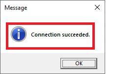{width="2.75in" height="1.8173917322834645in"}

If the test fails, you need to troubleshoot the failure based on the error message that pops up in the central pane.

### Saving and Editing Connection String

After you have configured the various database connection properties, you can check the connection string on the **Database Connection** page in order to ensure the properties are configured in desired ways.

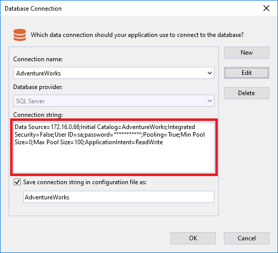{width="5.729166666666667in" height="5.208333333333333in"}

If you find that the properties are configured properly, you can click **OK** to finish the database connection. Otherwise, you can click **Edit** to change the properties.

### Checking Connection Results

If you have successfully established a connection to the database, you are supposed to see five folders in **DB Server Explorer**.

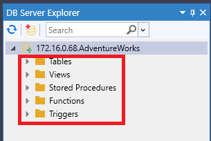{width="3.1770833333333335in" height="2.125in"}

The following table presents a brief introduction to the five folders.

|  **Folder**        |  **Description** |
|------------------- |------------------------------------------------------------------------------------------------------------------------------------------------------------------------------------------------|
|  Tables            |  A table is one of the most important operational objects of a database. Other objects of a database are built on the basis of tables. A table consists of rows (records) and columns (fields).|
|  Views             |  A view is a virtual table built on a base table. Its structure and content come from the base table.|
|  Stored Procedures |  A stored procedure is a set of SQL statements with an assigned name that is stored in the database in compiled form so that it can be shared by various programs.|
|  Functions         |  A function is a set of statements that execute upon request.|
|  Triggers          |  A trigger is a special stored procedure that is automatically executed in response to the database object, database, and server events.|

## Managing Database Connections

After you have successfully connected to a database, you are able to manage the database connection. For example, you can refresh, remove, modify, close, or rename the database connection.

**Refresh**

After you have successfully created a connection to a database, some modifications might be made to the database. In this case, you can select **Refresh** to update the database.

**Delete**

If you want to remove a database connection, you can right-click on the connected database and then select **Delete**.

**Modify Connection**

If you want to modify certain database connection properties, you can right-click on the connected database and then select **Modify Connection**, which leads you back to the **Database Connection** page.

**Close Connection**

Connections are a limited and relatively expensive resource. Therefore, you should always close the connection when you don't have to use it anymore so that it is returned to the connection pool.

**Rename**

If you find the current connection name undesirable, you can right-click on the connected database and then select **Rename** to specify a new connection name.

## Managing Database Objects

Database objects represent the logical structures of the database. After you have successfully connected to a database, you can manage the objects in the database.

{width="3.1770833333333335in" height="2.125in"}

**Refresh**

If some modifications have been made to the connected database, you can select **Refresh** for a particular folder so that the entire folder will be updated. In addition, you can select **Refresh** for a particular item in one of the five folders so as to update the selected item.

**Filter**

If you want to search for particular items from a database object that contains too many items, you can select **Filter** to filter the items based on supplied criteria.

**Copy**

Copies the name of the selected item in the folders so that you don't have to type every segment manually when you are writing your SQL statements.

**Show Table Schema**

Shows the collection of a table's relation schemas, which indicate the organization of data as a blueprint of how the table is constructed.

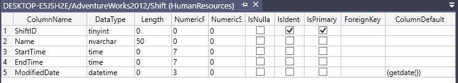{width="6.5in" height="1.1847222222222222in"}

**Show Table Data**

Shows all information about the table you select.

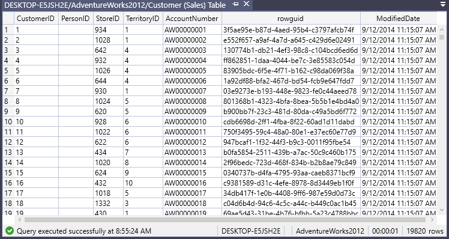{width="6.5in" height="3.4583333333333335in"}

## Querying

When you have successfully connected to a database and properly managed the database, you can begin to run SQL Query. This section offers a walkthrough of how you can run SQL Query.

### Accessing SQL Query Editor

When you want to request for data or information from a database, you need to gain access to the SQL Query editor where you can write your SQL statements. To access the SQL Query editor, you can select any item in all the folders but the Triggers folder and then select **New Query** from the right-click context menu, or you can just select **Tools** \> **SQL Query** \> **New Query**.

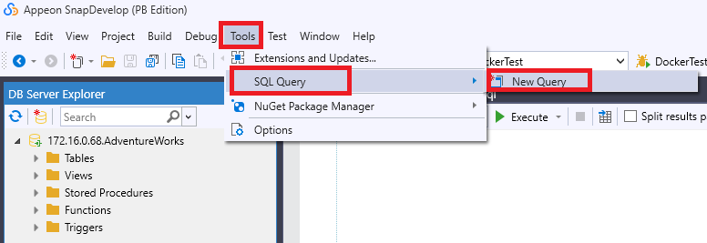{width="6.489583333333333in" height="2.2291666666666665in"}

### Writing SQL Queries

When you have accessed the SQL Query editor, you can begin to write your own SQL statements. When you are writing SQL statements, you can use three common SQL commands (***Select Top 100* SQL**, ***Select All* SQL**, and ***Select by Key* SQL**) to automatically generate SQL statements. To use these SQL commands, you can select any item in the Tables/Views folder and then select the wanted SQL command from the right-click context menu.

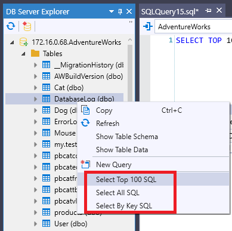{width="4.052083333333333in" height="4.03125in"}

***Select Top 100* SQL**

Automatically generates a SQL statement that selects the first 100 rows of data from the selected table.

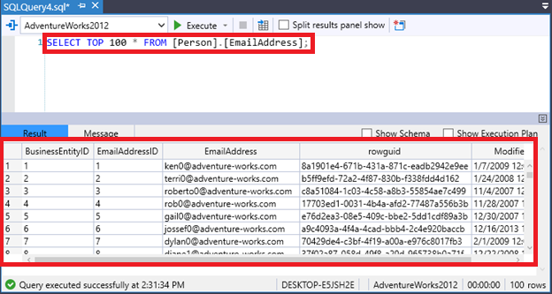{width="6.402401574803149in" height="3.4166666666666665in"}

***Select All* SQL**

Automatically generates a SQL statement that selects all data from the selected item in the Table or View folder.

***Select by Key* SQL**

Automatically generates a SQL statement that selects from the selected table a row uniquely identified by the primary key.

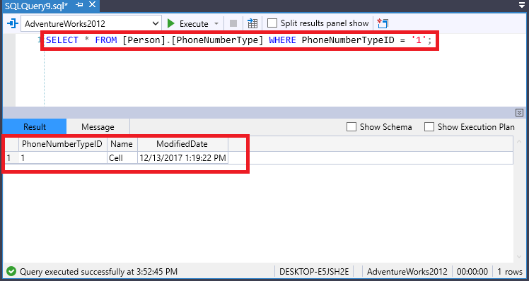{width="6.364583333333333in" height="3.3820155293088363in"}

### Executing SQL Queries

When you finish writing your SQL statements, you can click the **Execute** ({width="0.13651356080489938in" height="0.17291666666666666in"}) icon to execute them. 

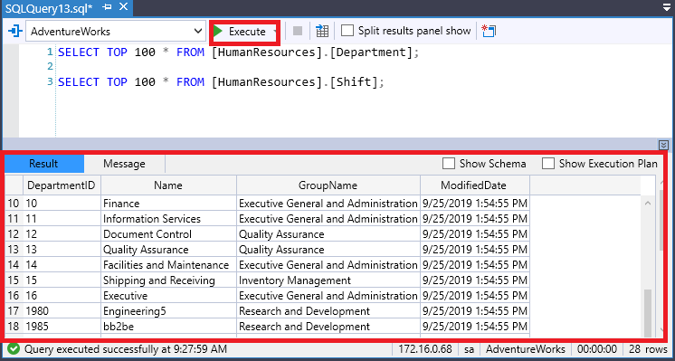{width="6.5in" height="2.0395833333333333in"}

### Viewing Query Results

After you have executed your SQL statements, you naturally want to view the query results. This section describes how you can select the format in which your results display, split results panels, view query message, and view the detailed steps for query execution.

#### Select Result Display Format

You can choose to view the query results in one of the three different formats, which are grid, text, and file.

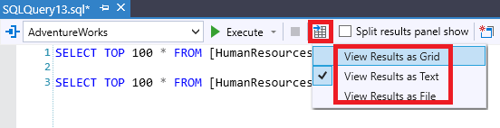{width="5.75in" height="1.4791666666666667in"}

**View Results as Grid**

Displays the query results in grid format, which is the default format.

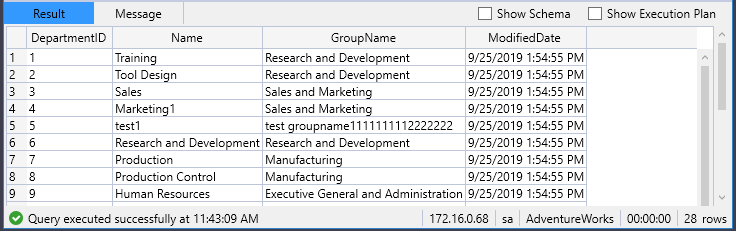{width="6.5in" height="2.0520833333333335in"}

**View Results as Text**

Displays the query results in text format.

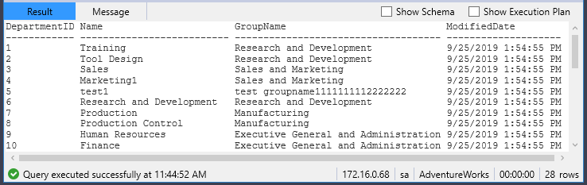{width="6.5in" height="2.0520833333333335in"}

**View Results as File**

Displays query results in file format. If you choose this way to display your query results, you need to export the results to an external file.

#### Split Results Panels

When you execute multiple SQL statements, you can enable this feature to display the query results in split panels, which allow you to quickly and conveniently view and compare related data in different panels.

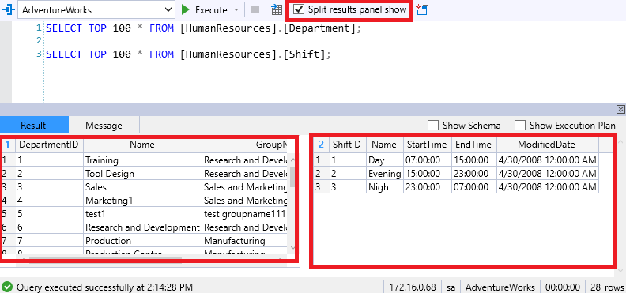{width="6.444589895013124in" height="3.03125in"}

#### View Query Message

After the SQL statements are executed, a message is returned, indicating the state of the query execution.

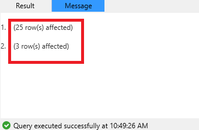{width="3.4166666666666665in" height="2.225534776902887in"}

#### Show Schema

You can enable this option to view the collection of the relation schemas for the table(s) involved in your SQL statements (see also the introduction to table schema at [Show Table Schema](#show-table-schema)).

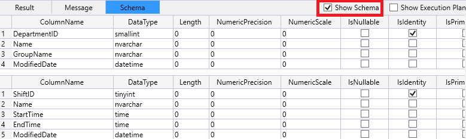{width="6.467083333333333in" height="1.9479166666666667in"}

#### Show Execution Plan

An execution plan is generated as a consequence of the query optimizer's effort to calculate the most efficient way to implement a particular SQL query. If you enable this option, you will see how a query was executed or how a query will be executed.

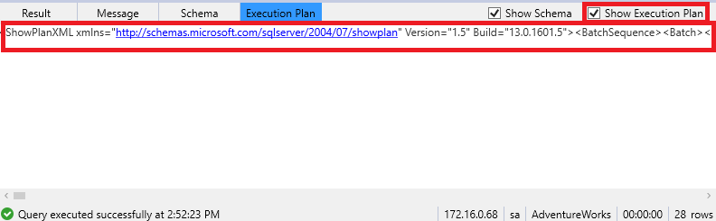{width="6.52096675415573in" height="2.0104166666666665in"}

### Processing Query Results

If you have chosen to display your query results in grid format, you can select a table item and then select an action you want to perform from the right-click context menu.

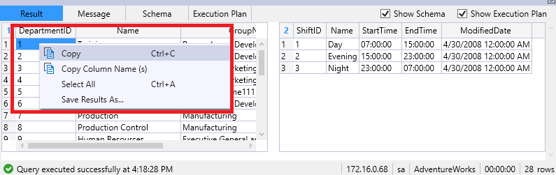{width="6.489583333333333in" height="2.0520833333333335in"}

**Copy**

Copies a table item so that you can paste it to the SQL Query editor or to an external file.

**Copy Column Name**

Copies the column name of the table so that you can paste it to the SQL Query editor or to an external file.

**Select All**

Selects all table items.

**Save Results As**

Exports the query results to an external CSV file.
