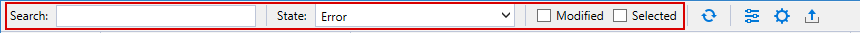
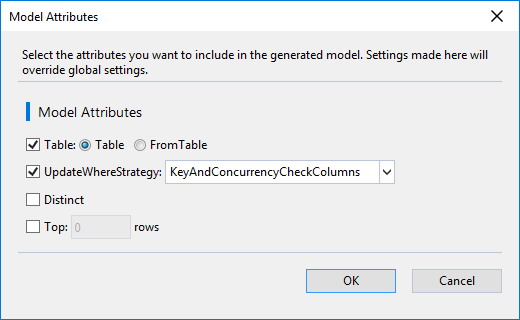
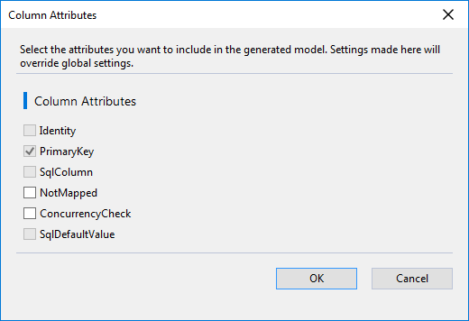
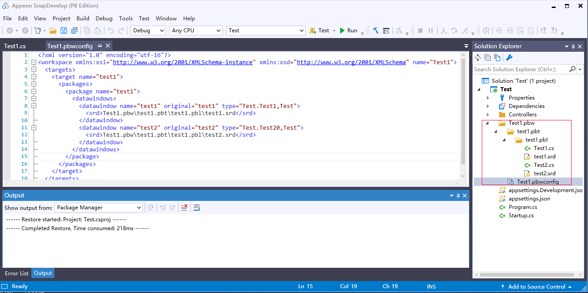
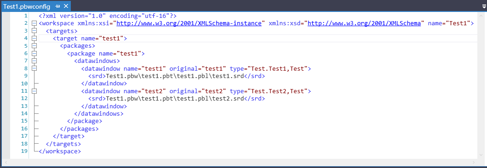

# Working with DataWindow Converter

**DataWindow Converter** is designed to use the DataWindow objects from PowerBuilder to generate the C\# data objects and models that can be used with SnapObjects in the C\# editor (such as SnapDevelop, Visual Studio etc.). In order to perform this operation, you need to have a PowerBuilder application which contains the DataWindow objects and a C\# project to which you want to export the DataWindow objects. To create a C\# project, select from **File** \> **New** \> **Target** \> **C\# Projects** in the PowerBuilder IDE (this will launch the SnapDevelop IDE).

## Launching DataWindow Converter

To launch the **DataWindow Converter**,

1.  Open the PowerBuilder application which contains the DataWindow object.

2. Right click the workspace, target, or library file, or the individual DataWindow object, and then choose **Generate C\# Models**.

   If you right click the workspace, target, or library file, all of the DataWindow objects contained in it will be displayed in the **DataWindow Converter**.

   If you right click the individual DataWindow, only that DataWindow will be displayed in the **DataWindow Converter**.

## Selecting the Database Connection

After you choose **Generate C\# Models** from the popup menu, the **Database Connection** window appears and requires you to select the database (or the data source) which you have used to create the DataWindow object. You can select an existing database connection or create a new one if this is the first time you use **DataWindow Converter**. The new database connection will be saved and become selectable when you open **DataWindow Converter** next time.

To create a new database connection,

1.  Click the **New Connection** button in the **Database Connection** main window.

2. In the window that follows, select a data source type and then specify the basic connection settings and/or the advanced settings (by clicking the **Advanced** button) for the selected data source type.

   The connection settings and the advanced settings are different according to the selected data source type.

3. After specifying the connection settings and/or advanced settings, click **Test Connection** to verify the connection is successful and then click **OK** to close the window and return to the **Database Connection** main window.

   On the **Database Connection** main window, you can verify or change the connection string, and save the connection string in the configuration file.

   Once you click **OK** on the **Database Connection** main window, **DataWindow Converter** tries to connect to the selected database.

If the DataWindow objects connect to more than one database, you can refer to [Creating multiple database connections](creating_multiple_database_connections) for how to create multiple database connections and parse the DataWindow objects.

**DataWindow Converter** supports the following database types and versions:

-   PostgreSQL 11.3, 10.1, or 9.6

-   Oracle 12c or 18c

-   SQL Server 2016 or 2017

-   SQL Anywhere 16 (16.0.0.2043 or later) or 17

## Configuring DataWindow Converter

Once connecting with the database successfully, **DataWindow Converter** generates the source code of C\# data models according to the DataWindow objects and the database. You can preview the code of C\# data models and then apply model and/or column attributes to the models. In **DataWindow Converter**, you can also perform the following tasks.

### Setting Global Options

On the toolbar of **DataWindow Converter**, click the **Global Option** icon ({width="0.1875in" height="0.1875in"}) to set options that are applicable throughout the whole model generation process.

- **Environment** options

  Under **Environment \| General**, you can select a theme for **DataWindow Converter**. Currently you can only select the **Dark** theme or the **Light** theme.

- **Model Generation** options

  Under **Model Generation \| Attributes**, you can select the model attributes and column attributes you want to include in the model. The selected attributes will be automatically applied to all DataWindow objects by default. If you want to make changes to individual DataWindow object, you can use the **Model Attributes** and the **Column Attributes** icons on the action bar of each DataWindow object. See [Applying model attributes or column attributes](applying_model_attributes_or_column_attributes) for details.

  After you select the attributes, you can click the **Preview** button to view the corresponding C\# code example.

  Under **Model Generation \| Parse Settings**, you can select two options: 1) whether to use underscores to replace all characters that are not alphanumerics or underscores in class names and property names; 2) whether to automatically parse the failed DataWindow objects when a new database connection is added (In some cases, DataWindow objects from multiple data sources need to be exported simultaneously).

### Locating the DataWindow object

All successfully parsed DataWindow objects are selected for export by default and DataWindow objects that failed to be parsed cannot be selected. You can use the toolbar of **DataWindow Converter** to quickly find the DataWindow object you want, for example, you can input the object name in the **Search** box to find the DataWindow, or you can select **Missing** or **Error** from the **State** list to show the problematic DataWindow objects which you can make corrections.

{width="5.864583333333333in" height="0.21875in"}

-   **Search** box \-- Searches for a particular DataWindow object.

- **State** list \-- Shows DataWindow objects according to their state.

  | Select this state | To                                                           |
  | ----------------- | ------------------------------------------------------------ |
  | **All**           | Show all DataWindow objects regardless of their state. This is the default option. |
  | **Waiting**       | Show only the DataWindow objects that are being parsed. This state appears only during the parsing process. |
  | **Completed**     | Show only the DataWindow objects that have been parsed successfully. |
  | **Warning**       | Show only the DataWindow objects whose models cannot be generated correctly because of duplicated class names etc. |
  |                   | You can click the **Warning** icon ({width="0.1875in" height="0.16666666666666666in"}) on the action bar of the DataWindow object to view the warning details. |
  | **Missing**       | Show only the DataWindow objects whose objects are invalid because of the database connection or table/column not found. |
  |                   | You can click the **Parsing Error** icon ({width="0.19791666666666666in" height="7.291666666666667e-2in"}) to view error details and the **Try Another Connection** icon ({width="0.17708333333333334in" height="0.1875in"}) on the action bar of the DataWindow object to create a new database connection. |
  | **Error**         | Show only the DataWindow objects in which exceptions occurred. You can click the **Parsing Error** icon ({width="0.16666666666666666in" height="0.16666666666666666in"}) on the action bar of the DataWindow object to view the error details. |

- **Modified** option \-- Shows only the DataWindow objects whose attributes have been modified.

  For how to modify the attribute(s), see [Applying model attributes or column attributes](applying_model_attributes_or_column_attributes).

- **Selected** option \-- Shows the DataWindow objects that are selected right now. You can use the **Select All** check box to select or de-select all DataWindow objects; or use the check box next to the individual DataWindow object to select or de-select a particular DataWindow object.

### Applying model attributes and column attributes

There are some model attributes and column attributes that you can apply to the C\# data models; and you can specify these attributes in the global level (for all DataWindows) or object level (for an individual DataWindow).

To apply the model or column attributes to *all DataWindows*,

1.  Click the **Global Options** icon ({width="0.1875in" height="0.1875in"}) on the toolbar of **DataWindow Converter**.

2. Under **Model Generation \| Attributes**, select the model attributes and/or column attributes.

   The selected attributes will be applied to all DataWindow objects by default.

To apply the model attributes to *a particular DataWindow,*

1.  Click the **Model Attributes** icon ({width="0.1875in" height="0.1875in"}) on the action bar of that DataWindow object.

2. In the **Model Attributes** dialog that appears, select the attribute.

   The selected attributes will override those in the **Global Options** window and will be applied to that DataWindow object only.

{width="5.114583333333333in" height="3.1458333333333335in"}

To restore to the original settings, you can click the **Table Restore** icon ({width="0.1875in" height="0.17708333333333334in"}) on the action bar of that DataWindow object.

To apply the column attributes to *a particular DataWindow*,

1.  Click the plus icon ({width="0.125in" height="0.125in"}) at the right end of the DataWindow object to expand and view the column list.

2. Then select the check box of each attribute on each column or click the **Column Attributes** icon ({width="0.1875in" height="0.1875in"}) on the action bar of each column to select the attribute in the **Column Attributes** dialog.

   The selected attributes will override those in the **Global Options** window and will be applied to that column only.

{width="5.114583333333333in" height="3.5in"}

To restore to the original settings, you can click the **Column Restore** icon ({width="0.1875in" height="0.17708333333333334in"}) on the action bar of that column to restore that column, or click the **Columns Restore** icon on the action bar of the DataWindow to restore all columns of that DataWindow.

To restore both the model attributes and column attributes to the original settings, you can click **All Restore** icon ({width="0.1875in" height="0.1875in"}) on the action bar of that DataWindow.

### Creating multiple database connections

**DataWindow Converter** uses only one database connection when it is opened; therefore, if the DataWindow objects connect to more than one database, some objects may not be parsed successfully. They will be reported as \"**Missing**\" (Invalid object name \'xxx\') or \"**Error**\" (Table \'xxx\' not found) in the **Output** window; and a **Parsing Error** icon ({width="0.19791666666666666in" height="7.291666666666667e-2in"} or {width="0.16666666666666666in" height="0.16666666666666666in"}) will appear on the action bar of the problematic DataWindow.

To resolve this problem,

1.  Click the **Try Another Connection** icon ({width="0.17708333333333334in" height="0.1875in"}) (if available) on the action bar of the problematic DataWindow object, or select the **New Connection** menu from the **Server** section at the bottom right corner of **DataWindow Converter** (for example, {width="2.1041666666666665in" height="0.19791666666666666in"}).

2.  In the **Database Connection** window that appears, create a new database connection for the object.

3. After you create a new database connection and click **OK**, you will be prompted "*Whether to reparse all DataWindows?*" Click **Yes** to parse all failed DataWindows or **No** to parse only the current DataWindow.

   You can also click the **Reparse** icon ({width="0.1875in" height="0.15625in"}) on the toolbar to parse all failed DataWindow objects.

### Exporting C\# models

After the DataWindow objects are parsed successfully and the model and column attributes are applied as needed, you can export the DataWindow objects as data models to a C\# project.

To export the DataWindow objects to a C\# project, you

1.  Select the desired DataWindow objects.

2.  Click the **Model Export** icon ({width="0.16666666666666666in" height="0.16666666666666666in"}) on the toolbar of **DataWindow Converter**.

3. In the **Model Export** window that appears, select the C\# project from the **Project** list or click **Browse** to select the project to which you want to export the DataWindow objects.

   In the **Model Export** window, you can also specify the following options.

   **Save Option**: Whether to overwrite the models if the models already exist in the project.

   **Output SRD**: Whether to output the SRD file. The SRD files are mainly used by the .NET DataStore for tracking the corresponding syntax that is parsed and to identify the corresponding model. Both the SRD file and its corresponding model are required by the .NET DataStore. The data query operation depends on the syntax included in the SRD file, and the Update, Delete and/or Insert operations depend on the syntax included in the model.

   **New Folder**: The name of the folder if you want to place the exported models to this folder under the project.

   **Namespace**: The namespace of the selected C\# project will be automatically displayed. You can change the namespace if you want.

4. Click **Export** to output the DataWindow objects.

   There will be a popup window indicating the number of objects that are successfully exported.

### Overview of the exported files

After the DataWindow objects are exported as data models to a C\# project, the C\# project will include the following files.

**Folder structure**

The structure is the same as the PowerBuilder application. There will be a newly added folder whose name suffix is pbw*.* The pbw folder contains folder(s) suffixed with pbt, which in turn contains folder(s) suffixed with pbl.

{width="5.864583333333333in" height="2.9166666666666665in"}

**.pbwconfig file**

This file is generated only when you select **Yes** for the **Output SRD** option in the **Model Export** window (**Yes** is the default setting).

This configuration file contains all the information used to parse the DataWindow objects. When the DataWindow objects are being parsed, this configuration file is used to identify the SRD files and their corresponding models.

The configuration file looks like this.

{width="5.864583333333333in" height="2.0208333333333335in"}

-   workspace name \-- the name of the pbw file of the original PowerBuilder application;

-   target name \-- the name of the pbt file of the original PowerBuilder application;

-   package name \-- the name of the pbl file of the original PowerBuilder application;

-   datawindow

    -   name \-- the name of the data object used in the .NET DataStore;

    -   original \-- the name of the DataWindow object in PowerBuilder;

    -   type -- the .NET class type;

-   srd \-- the location of the DataWindow SRD file.

**.cs files**

The CS file contains the source code of the C\# model. Model is short for the data model class which represents the application data entry. It maps columns to database tables and contains the related SQL. The SQL of the model is generated based on various attributes, which gives developers control over the SQL.

When using the .NET DataStore, database operations such as Insert, Update or Delete are performed via its corresponding model.

**.srd files**

The SRD files are exported only when you select **Yes** for the **Output SRD** option in the **Model Export** window (**Yes** is the default setting).

The SRD file contains the source code of the DataWindow object. They can be completely exported to the C\# project and included in the folder suffixed with pbl. SRD files are required by the .NET DataStore.

## Handling Parsing Failures or Errors

Due to the flexible and various use of the DataWindow features, a few DataWindow objects might not be successfully parsed by the **DataWindow Converter** or work as expected in the C\# project. When a DataWindow object failed to be parsed or failed to work in the C\# project, you should check the reported errors or warnings in the **DataWindow Converter** to analyze the cause or check the following sections to determine the cause.

### Causes of parsing failure in model generation

**DataWindow Converter** parses DataWindows according to their SRD files and then generates C\# models. The following cases may result in parsing failure, which means that model cannot be successfully generated from a DataWindow.

**Database Connection**

-   If you connect to Oracle database, it is strongly recommended that you use Oracle 12c or later.

**DataWindow**

DataWindow types that may resulting in parsing failure include:

-   Composite, Crosstab, OLE, and RichText

-   Nested reports

DropDownDWs that may result in parsing failure include:

-   A DropDownDW sets itself as its DataWindow object

**DataWindow Column**

Column types that may result in parsing failure include:

-   (If it is SQL Server connection) Datetime2

-   Char(-1) being the column type

Column names/dbnames that may result in parsing failure include:

-   Contain some database reserved words, for example, USER, NAME (reserved word in Oracle)

-   A column has duplicated name with the DataWindow that it belongs (This is a limitation in C\# development: member names cannot be the same as their enclosing type.)

-   Case-insensitive duplicate dbnames.

Column initial values that may result in parsing failure if:

-   The initial value of a column is not empty, null, spaces, Today, or a constant of the correct type

**DataWindow SQL**

Elements in SQL syntax that may result in parsing failure include:

-   SQLCA.DBParm parameters (including DelimitIdentifier, TrimSpaces, StaticBind, DisableBind) are ignored in the model generation. Therefore, if the SQL syntax itself is incompatible with the DBMS, there may be parsing error. For example, if you access SQL Anywhere or Oracle, you cannot use single quotes to enclose table and column names in the SQL syntax.

-   Contain comments

-   Contain key words such as WITH, SET, DECLARE, EXECUTE

-   Contain user defined function(s)

-   Contain ('\*=') operator

-   Use double bars ("\|\|") for concatenation

-   Contain SELECT Distinct COL1 but COL1 is text type

-   Complex SQL sub-queries or nested queries. For example, IF \... then select \... else if \... then select \... else select \... end if

-   (If the data source is a stored procedure) A parameter in the stored procedure is not declared but is assigned with a value.

-   A default value is directly assigned to an argument in the SQL. For example, TABLE(\... arguments=((\"a\_plant\", string, \"test\"),(\"a\_return\", string)) )

-   Missing spaces between words. Such as, missing a space after the SELECT DISTINCT keyword (for example, SELECT Distinct"audit"."p\_lname"); missing a space between parameters (for example, export.pdf(method=0distill.customPostScript=\"0\" xslfop.print=\"0\"))

**Other SRD Settings**

Other SRD settings that may result in parsing failure include:

-   Any of the X/Y/Width/Height settings has decimal value

### Causes of errors in generated models

Although a model can be generated successfully for a DataWindow, the model may not work correctly in the following cases:

-   If a DataWindow has used expression in its computed field, the GetItem function of the model generated from the DataWindow sometimes may not work well.

-   If the SELECT statement in the DataWindow SQL refers to a computed column with an empty string and no alias, the parser will use a default name for the column. The generated model may fail to work because the column in the model cannot be mapped back to the DataWindow column by name.

-   If the columns returned by the DataWindow SQL are more than the columns defined in the DataWindow painter, the generated model may fail to work because the column in the model cannot be mapped back to the DataWindow column by name.

-   If a DataWindow column has default value that contains double quotes, you must add escape character (\\) in the double quotes in the generated model, to make sure the default value can be interpreted correctly at runtime.

-   If the DataWindow SRD contains some parameters in the UI or Group By section, the model generated from the DataWindow may fail to create the datastore.

-   Contains some parameters that will display in the UI

- If a DataWindow contains expression which calls a global function, the global function won't work well in the generated model.

  This issue can be resolved by the following workaround steps:

1. Create a static function in the class file that provides the same functionality as the global function;

   For example, using the following script to create the static function:

   ```c#
   public class MyGlobalFunc 
       { 
         public static Int32 gf_getid2(Int32 id) 
           { 
             return id;
            } 
       }
   ```

2. Register the function by calling PbExpressionFactory.Current.AddGlobalFunc\<MyGlobalfunc\>(), where MyGlobalfunc is the class that the newly created static function belongs to and it should not be a static class.

   For example, registering the function in Startup.cs:

   ```c#
   public void ConfigureServices(IServiceCollection services) 
       { 
   
         //Register the function for use by the DataWindow expression
         PbExpressionFactory.Current.AddGlobalFunc<MyGlobalFunc>();
   
         ...
        }
   ```
